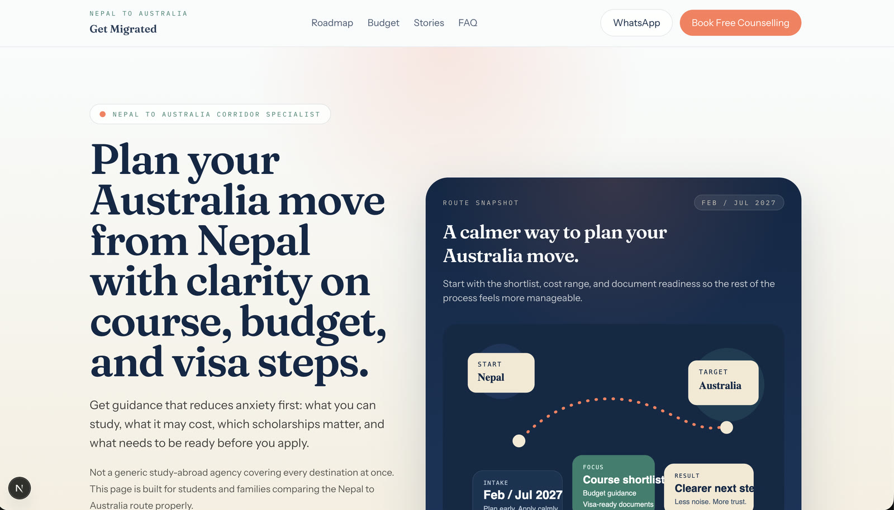

# Get Migrated

Corridor-focused landing page concept for Nepali students exploring study options in Australia.

This project uses a `src`-first Next.js App Router structure with React 19, TypeScript, and Tailwind CSS v4.

## Preview

Desktop hero:



Mobile hero:


## Design System

- Read [`DESIGN.md`](./DESIGN.md) before making any visual or UI changes.
- Typography, color, spacing, layout direction, and product tone are defined there.
- The current design direction is editorial trust with corridor-specific warmth for the Nepal to Australia route.

## Getting Started

Install dependencies:

```bash
npm install
```

Run the development server:

```bash
npm run dev
```

Open http://localhost:3000 in your browser.

## Available Scripts

- `npm run dev`: start the local development server
- `npm run build`: create a production build
- `npm run start`: run the production server
- `npm run lint`: run ESLint across the repo

There is currently no configured test runner in `package.json`, so there is no full-suite or single-test command yet.

## Project Structure

```text
.
├── docs/
│   └── project-structure.md
├── public/
│   ├── landing-page.jpg
│   ├── landing-page-mobile.jpg
│   └── ...
├── src/
│   ├── app/
│   ├── components/
│   ├── lib/
│   ├── tests/
│   └── ...
├── DESIGN.md
├── next.config.ts
├── package.json
├── tsconfig.json
└── README.md
```

Detailed structure documentation: `docs/project-structure.md`.

## Key Files

- `src/app/page.tsx`: main landing page content and form flow
- `src/app/layout.tsx`: global layout and font loading
- `src/app/globals.css`: theme tokens and Tailwind theme mapping
- `src/components/ui/*`: shared UI wrappers built on `@base-ui/react`
- `DESIGN.md`: design source of truth for visual decisions

## Path Aliases

TypeScript alias is configured as:

```ts
@/* -> ./src/*
```

Example import:

```ts
import { Button } from "@/components/ui/button";
```

## Validation

- Targeted lint: `npx eslint src/app/page.tsx`
- Full compile and type validation: `npm run build`

## Learn More

- https://nextjs.org/docs
- https://nextjs.org/learn
